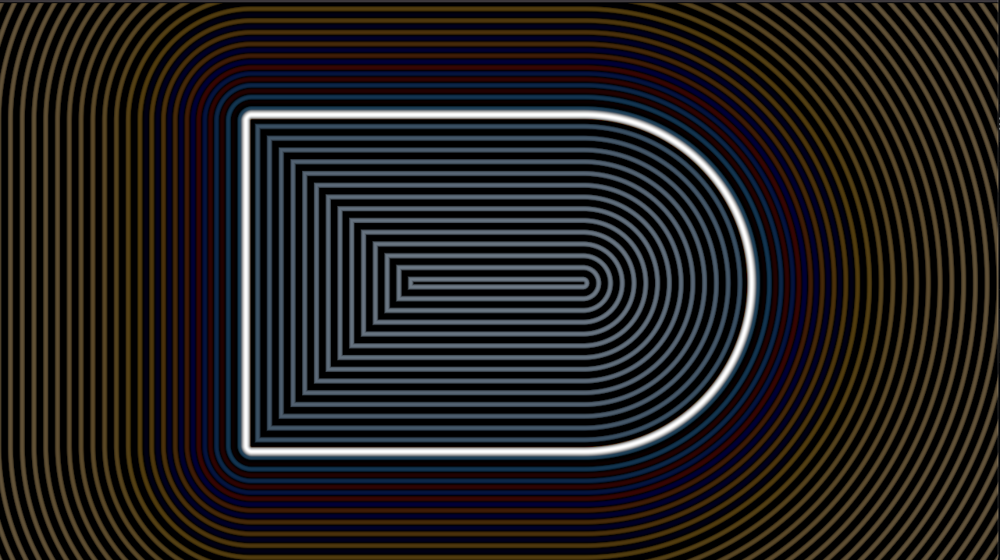

# shadertoy

This is an [`wgpu`](https://github.com/gfx-rs/wgpu-rs/) backed implementation of [shadertoy](https://www.shadertoy.com).

Edit the file `shader.wgsl` to change the shader. Shaders are rebuilt when you save `shader.wgsl`.

